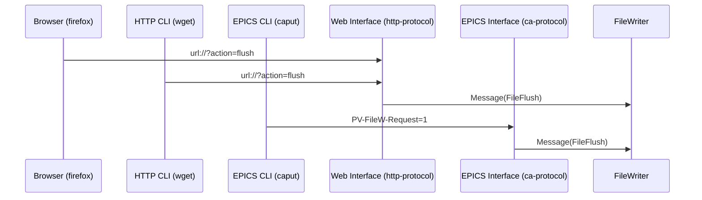
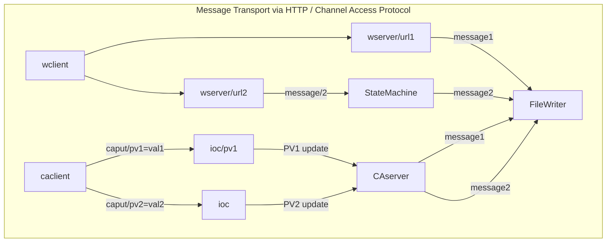

# MARTe Demo : FileWriter-5

If you are still going after the trick challenges in [FileWriter-4X](../FileWriter-4/README.md) then I applaud
your enthusiasm and resilience.

This fifth variation on FileWriter addresses the last point in the previous example which is how to
create an interface that can allow external applications to trigger messages to data sources.
This is best illustrated in a diagram.



The choice of using a WebServer component or an EPICSCA component as the interface to external
applications depends on whether there are system benefits from having tighter integration
with one or other of these protocols.

Both interfaces support sending messages.  In the HTTP case, a URL is directly exposed which maps
to a message definition.  *Note that the message contents in this case are fixed in the configuration file.*
Thus the sequence of actions is

	
```mermaid
flowchart LR
subgraph WebServer
direction TB
subgraph Handlers with predefined messages
direction LR
flushURL --> FileWriter::Flush
subgraph FileWriter::Flush
direction BT
Destination1=SignalsWriter -->flushMSG
Function1=FlushFile-->flushMSG
Params1=X-->flushMSG
end
openURL --> FileWriter::Open
subgraph FileWriter::Open
direction BT
Destination2=SignalsWriter -->openMSG
Function2=FlushFile-->openMSG
Params2=X-->openMSG
end
end
end
WebClient=GET=url-->WebServer -- Send Message -->SignalsWriter
```

Very much the same architecture applies with an EPICS channel access server.  However, as is familiar
if you have followed the relevant training, a co-process is required to provide the ChannelAccess server.
This co-process is an `ioc` program which provides the ProcessVariable endpoints, much as the 
internal MARTe2 webserver provides the URL endpoints.



Specifically, the PV model (which requires an ioc to be launched using the matching EPICS database file) exposes:

1. FileWriter-Behaviour-5:STATUS
   - Read this PV to retrieve the current state readback from the StateMachine
   - 0 = Idle ; 1 = Run
1. FileWriter-Behaviour-5:COMMAND  
   - Set to 0 for GOTOIDLE message to StateMachine
   - Set to 1 for GOTORUN message to StateMachine
1. FileWriter-Behaviour-5:RESET  
   - Change for RESET message to StateMachine


There are two options for running the demo.  The simple case is to start the application directly in the Run state thus:

## Interactive Format

Start the docker and set up the environment to launch MARTe.

```
docker run -it -p 8084:8084 avstephen/marte2-demos-sigtools-ubuntu1804:ayr
root@abcedf:/opt/MARTe/Projects/MARTe2-sigtools/bin# source setenv.sh
root@abcedf:/opt/MARTe/Projects/MARTe2-sigtools/bin# source m2-completion.bash
```
Two terminals are required to see the behaviour matches expectations.

In the first terminal, set up to watch for the changing contents of a file, which by default is
to be created in the MARTe2-demos-sigtools/temp directory.

```
root@abcedf:/opt/MARTe/Projects/MARTe2-sigtools/bin# cd ../MARTe2-demos-sigtools/temp
root@abcedf:/opt/MARTe/Projects/MARTe2-sigtools/MARTe2-demos-sigtools/temp# rm -f *.csv
root@abcedf:/opt/MARTe/Projects/MARTe2-sigtools/MARTe2-demos-sigtools/temp# watch -n 1 cat *.csv
```
In the other terminal, first start the EPICS IOC co-process using the m2ioc wrapper.
The ioc process is run within a tmux container.  Note that the tmux namespace feature is
used to keep the IOC processes from interfering with "normal" tmux sessions.  To
list the IOC tmux sessions either use `tmux -L MARTe2-sigtools list-sessions` or
alternatively the `m2ps` option.
```
root@abcedf:/opt/MARTe/Projects/MARTe2-sigtools/bin# ./m2ioc STapp-0007-FileWriter-5-IOC.db
```

In the other terminal, run the example, providing the command line message to the StateMachine to START.
This will set the run state to IDLE.
```
root@abcedf:/opt/MARTe/Projects/MARTe2-sigtools/bin# ./m2 STapp-0007-FileWriter-5.cfg -m StateMachine:START
```

Now use the `caget` and `caput` commands to exercise the state changes that will select the Run state
which in turn will cause data to be written to the CSV file.

If you get stuck, then read the [Hint-1](Hint-1.md)

